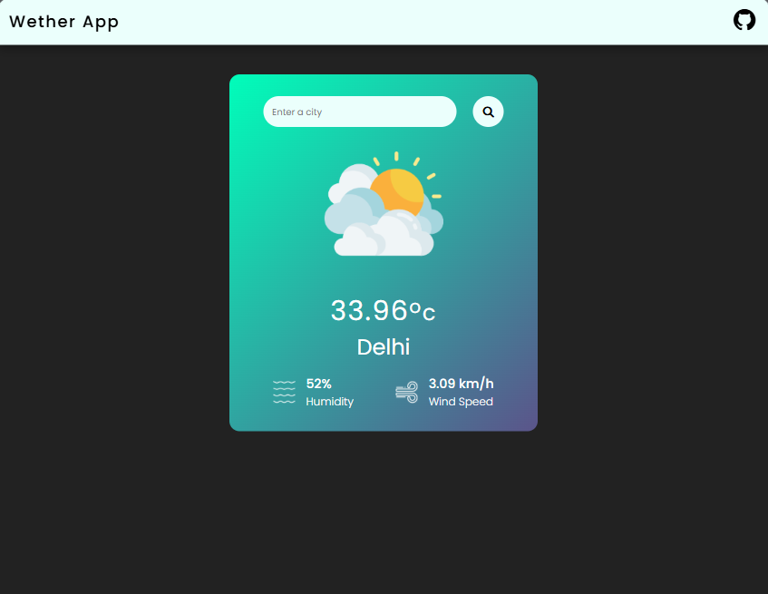

# 🌤️ Weather App

A simple and responsive weather application built with **HTML, CSS, and vanilla JavaScript**. It uses the **OpenWeatherMap API** to fetch current weather information for a city and displays the temperature, humidity, wind speed, and weather condition.

## ✨ Features

- 🔎 Search weather by city name
- ⌨️ Search by pressing **Enter** or clicking the search button
- 🌡️ Displays current temperature in Celsius
- 💧 Displays humidity
- 💨 Displays wind speed
- 🌤️ Changes the weather icon based on the current weather condition
- 📍 Loads **Delhi** weather by default
- 📱 Responsive UI
- 🎨 Custom weather-themed interface

## 🛠️ Technologies Used

- **HTML5** — page structure
- **CSS3** — styling and responsive layout
- **JavaScript (ES6+)** — application logic and API requests
- **OpenWeatherMap API** — weather data
- **Font Awesome** — icons
- **Google Fonts** — typography

## 📁 Project Structure

```text
weatherApp/
├── images/
│   ├── clear.png
│   ├── humidity.png
│   ├── wind.png
│   └── ...
├── index.html
├── script.js
├── style.css
└── README.md
```

## 🚀 Getting Started

### 1. Clone the repository

```bash
git clone https://github.com/rishabhjha05/weatherApp.git
cd weatherApp
```

### 2. Configure the OpenWeatherMap API

This project uses the OpenWeatherMap Current Weather API.

Create an API key from OpenWeatherMap and configure the application with your key.

> **Security note:** The current project calls the OpenWeatherMap API directly from browser-side JavaScript. API keys placed in frontend JavaScript are visible to users. For a production application, use an appropriate server-side proxy/backend and restrict or rotate exposed keys.

### 3. Run the application

Because this is a static frontend project, you can open `index.html` directly in a browser.

For a local development server, you can also use VS Code's **Live Server** extension or another static HTTP server.

## 🔌 API

The application uses the OpenWeatherMap Current Weather endpoint:

```text
https://api.openweathermap.org/data/2.5/weather
```

The city is passed through the `q` query parameter.

The application uses data including:

- `main.temp` — temperature
- `main.humidity` — humidity
- `wind.speed` — wind speed
- `weather[0].main` — weather condition
- `name` — city name

The API returns temperature in Kelvin by default, and the application converts it to Celsius:

```js
(data.main.temp - 273.15).toFixed(2)
```

## 🖥️ How It Works

1. The application loads with Delhi as the default city.
2. The user enters a city name.
3. JavaScript sends a request to OpenWeatherMap.
4. The JSON response is processed.
5. The UI is updated with:
   - Temperature
   - City name
   - Humidity
   - Wind speed
   - Weather icon
6. If the request fails, the application displays an error alert.

## 📸 Screenshots

Add screenshots of the application here:



## 🧑‍💻 Future Improvements

Some possible improvements:

- Add a loading state while fetching weather data
- Improve error messages for invalid cities and API errors
- Add a 5-day weather forecast
- Add temperature unit switching between Celsius and Fahrenheit
- Add current-location weather using browser geolocation (Added in commit #b46d2b5)
- Improve accessibility
- Move API requests behind a backend/serverless function
- Add API-key restrictions and better secret management

## 🤝 Contributing

Contributions are welcome.

1. Fork the repository
2. Create a feature branch

```bash
git checkout -b feature/your-feature
```

3. Make your changes
4. Commit your changes

```bash
git add .
git commit -m "Add your feature"
```

5. Push your branch

```bash
git push origin feature/your-feature
```

6. Open a Pull Request

## 📄 License

This project currently does not specify a license.

If you want others to freely use, modify, and distribute the project, consider adding an appropriate open-source license.
